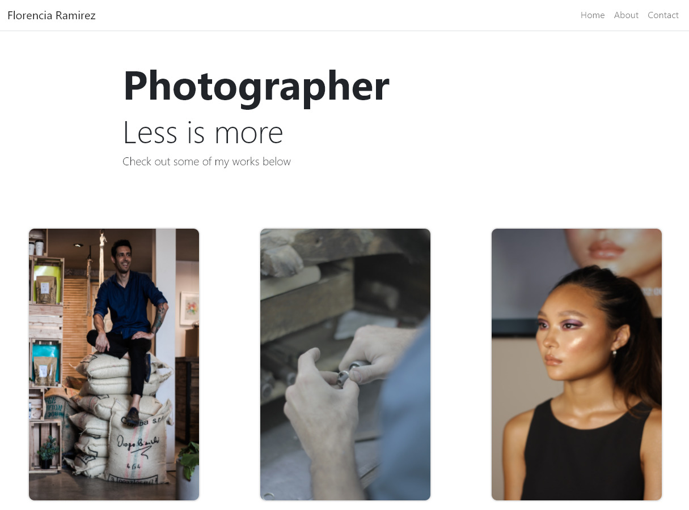

This project was bootstrapped with [Create React App](https://github.com/facebook/create-react-app).

## Available Scripts

In the root folder you can run:

### `npm install` : installs all the dependencies needed.
### `npm start`: runs the app in the development mode. 

Open [http://localhost:3000](http://localhost:3000) to view it in the browser.

The page will reload if you make edits.
You will also see any lint errors in the console.

The page looks like this:

if you click in the photo, you can see more details

It has an about me section and also a contact section that is connected to sendGrid email.

the links from the cell phone look like this:

